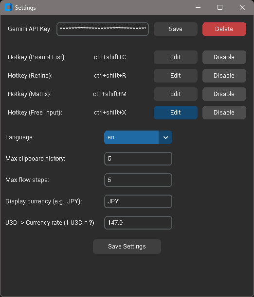
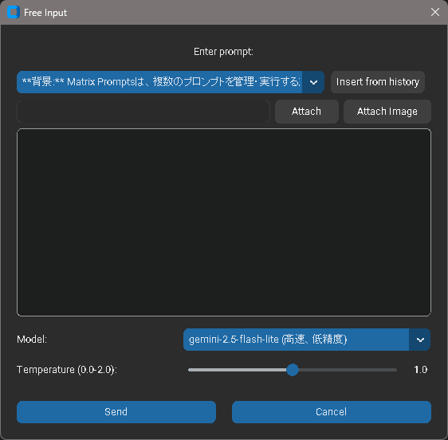
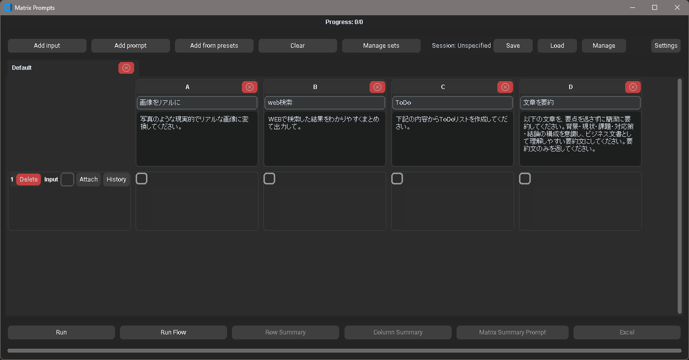
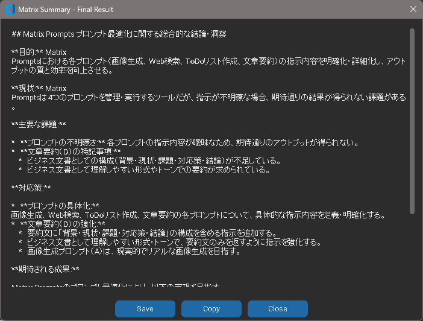

# Gem Clip

[](img/main_list.png)

**Gem Clip**は、クリップボードの内容やファイルをGoogle Gemini APIで瞬時に処理するためのWindows向けデスクトップツールです。

ホットキーを押すだけで、あらかじめ登録したプロンプトを呼び出し、テキストの校正、要約、翻訳、アイデア出し、画像からのテキスト抽出（OCR）など、あらゆるタスクを効率化します。

## ✨ 特徴 (Features)

*   **🚀 ホットキーで即時起動:** `Ctrl+Shift+C`などのホットキーで、いつでもプロンプト選択画面を呼び出せます。
*   **📋 多様な入力ソース:** クリップボードにあるテキスト、画像、ファイルのパスを自動で認識します。ファイルはドラッグ＆ドロップでも添付可能です。
*   **🔧 カスタマイズ可能なプロンプト:** あなたのニーズに合わせて、プロンプトを自由に追加・編集・並び替えできます。モデルや温度（Temperature）などのパラメータも個別に設定可能です。
*   **📊 強力なマトリクス処理:** 複数の入力データ（行）と複数のプロンプト（列）を組み合わせ、一括で処理を実行できます。市場調査の分析や、複数パターンの文章生成などに威力を発揮します。
*   **🌐 多言語対応:** UIは日本語と英語を切り替え可能です。
*   **🤫 安全なAPIキー管理:** APIキーはOSの資格情報マネージャーに安全に保存されます。

## 📥 インストール (Installation)

### 前提条件

*   Windows OS
*   Python 3.9以上

### 手順

1.  **リポジトリのクローン:**
    ```bash
    git clone https://github.com/youshinh/gem-clip.git
    cd gem-clip
    ```

2.  **依存ライブラリのインストール:**
    プロジェクトには多数のライブラリが必要です。以下のコマンドでインストールしてください。
    ```bash
    pip install google-generativeai customtkinter pystray pillow pyperclip keyring ctkmessagebox
    ```

3.  **Google AI APIキーの取得:**
    [Google AI for Developers](https://ai.google.dev/) にアクセスし、APIキーを取得してください。

## 🚀 使い方 (Usage)

### 1. 起動とAPIキー設定

1.  以下のコマンドでアプリケーションを起動します。
    ```bash
    python -m gemclip
    ```
    初回起動時、タスクトレイにアイコンが表示されます。

2.  タスクトレイのアイコンを右クリックし、「設定 (Settings)」を選択します。
    [](img/setting.png)

3.  設定画面が開いたら、「API Key」の欄に取得したGoogle AI APIキーを入力し、「Save & Close」ボタンを押します。

### 2. プロンプトの管理

タスクトレイメニューから「プロンプト管理 (Prompt Manager)」を開くと、メイン画面が表示されます。

[](img/main_list.png)

*   **追加:** `+ Add Prompt`ボタンで新しいプロンプトを作成できます。
*   **編集:** 各プロンプトの「編集 (Edit)」ボタンで、名前、システムプロンプト、モデル、パラメータなどを変更できます。
*   **並び替え:** 各行の「≡」ハンドルをドラッグ＆ドロップして、プロンプトの表示順を変更できます。
*   **削除:** 「削除 (Delete)」ボタンで不要なプロンプトを削除します。

[](img/prompt_setting.png)

### 3. 基本的な使い方（プロンプトの実行）

1.  処理したいテキストや画像をクリップボードにコピーします。
2.  ホットキー（デフォルト: `Ctrl+Shift+C`）を押します。
3.  カーソル位置にプロンプト選択ウィンドウが表示されます。実行したいプロンプトをクリックします。
4.  処理が実行され、完了すると結果がクリップボードにコピーされ、デスクトップ通知が表示されます。

### 4. 自由入力

ホットキーで表示されるプロンプト選択ウィンドウで「自由入力 (Free Input)」を選ぶと、専用のダイアログが開きます。

[](img/free_input.png)

ここに直接指示を入力して、一度きりのタスクを実行できます。ファイルの添付もこの画面から可能です。

### 5. マトリクス一括処理

タスクトレイメニューから「マトリクス処理 (Matrix Processor)」を選択すると、マトリクス処理ウィンドウが開きます。

1.  **データ入力:** 左側のテキストエリアに、処理したいデータを1行に1アイテムずつ入力します。（例: 商品レビュー、顧客からの質問など）
    [](img/matrix_input.png)

2.  **プレビューと実行:** 「プレビュー (Preview)」ボタンを押すと、入力データを行、プロンプトを列とする表が生成されます。実行したいセルにチェックを入れ、「選択項目を実行 (Run Selected)」ボタンを押します。
    [](img/matrix_preview.png)

3.  **結果の確認:** 処理が完了すると、各セルの結果が表示されます。行ごと、または列ごとのサマリーも生成できます。
    [](img/matrix_rowcol_result.png)
    [](img/matrix_rowcol_summary.png)

## 💻 開発 (Development)

*   **アプリケーションの実行:**
    ```bash
    python -m gemclip
    ```
    オプション:
    *   `--lang [en|ja]`: UI言語を指定
    *   `--theme [system|light|dark]`: テーマを指定

*   **テストの実行:**
    ```bash
    python -m pytest -q
    ```

## 📄 ライセンス (License)

このプロジェクトは MIT License のもとで公開されています。