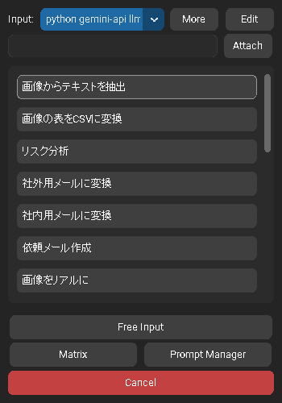
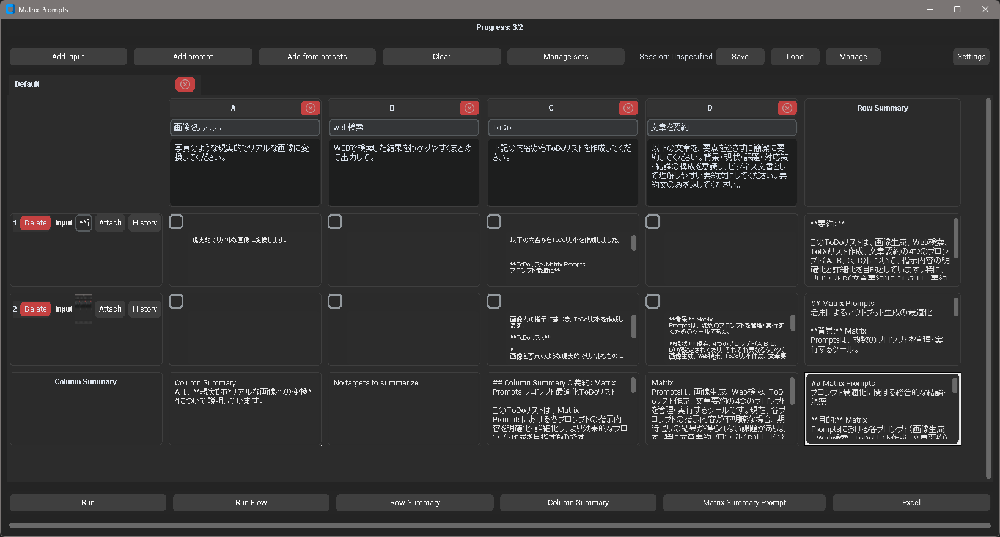

# Gem Clip

[](img/main_list.png)

**Gem Clip** is a desktop tool for Windows designed to instantly process clipboard content and files using the Google Gemini API.

With a simple hotkey, you can summon pre-registered prompts to streamline a variety of tasks, including text proofreading, summarization, translation, brainstorming, and text extraction from images (OCR).

## ✨ Features

*   **🚀 Instant Access with Hotkeys:** Bring up the prompt selection window anytime with a hotkey like `Ctrl+Shift+C`.
*   **📋 Versatile Input Sources:** Automatically recognizes text, images, and file paths on the clipboard. Files can also be attached via drag-and-drop.
*   **🔧 Customizable Prompts:** Freely add, edit, and reorder prompts to suit your needs. You can also configure parameters like the model and temperature for each prompt.
*   **📊 Powerful Matrix Processing:** Batch-process multiple input data (rows) against multiple prompts (columns). This is highly effective for tasks like market research analysis or generating multiple variations of text.
*   **🌐 Multi-language Support:** The UI can be switched between Japanese and English.
*   **🤫 Secure API Key Management:** Your API key is securely stored in the OS credential manager.

## 📥 Installation

### Prerequisites

*   Windows OS
*   Python 3.9 or higher

### Steps

1.  **Clone the repository:**
    ```bash
    git clone https://github.com/youshinh/gem-clip.git
    cd gem-clip
    ```

2.  **Install dependencies:**
    The project requires several libraries. Install them with the following command:
    ```bash
    pip install google-generativeai customtkinter pystray pillow pyperclip keyring ctkmessagebox
    ```

3.  **Get a Google AI API Key:**
    Visit [Google AI for Developers](https://ai.google.dev/) to obtain your API key.

## 🚀 Usage

### 1. Launch and Set Up API Key

1.  Launch the application with the following command:
    ```bash
    python -m gemclip
    ```
    On the first launch, an icon will appear in your system tray.

2.  Right-click the tray icon and select "Settings".
    [](img/setting.png)

3.  In the settings window, enter your Google AI API key in the "API Key" field and click the "Save & Close" button.

### 2. Managing Prompts

Open the "Prompt Manager" from the tray menu to display the main window.

[](img/main_list.png)

*   **Add:** Create a new prompt with the `+ Add Prompt` button.
*   **Edit:** Modify the name, system prompt, model, parameters, and more using the "Edit" button for each prompt.
*   **Reorder:** Drag and drop the "≡" handle on each row to change the display order of prompts.
*   **Delete:** Remove unnecessary prompts with the "Delete" button.

[](img/prompt_setting.png)

### 3. Basic Usage (Executing a Prompt)

1.  Copy the text or image you want to process to your clipboard.
2.  Press the hotkey (default: `Ctrl+Shift+C`).
3.  The prompt selection window will appear at your cursor's location. Click the prompt you want to execute.
4.  The process will run, and upon completion, the result will be copied to your clipboard, and a desktop notification will appear.

### 4. Free Input

Select "Free Input" from the prompt selection window to open a dedicated dialog.

[](img/free_input.png)

Here, you can enter instructions directly to perform one-off tasks. You can also attach files from this screen.

### 5. Matrix Batch Processing

Select "Matrix Processor" from the tray menu to open the matrix processing window.

1.  **Input Data:** Enter the data you want to process in the left text area, one item per line (e.g., product reviews, customer questions).
    [](img/matrix_input.png)

2.  **Preview and Execute:** Click the "Preview" button to generate a table with your input data as rows and prompts as columns. Check the cells you want to execute and click the "Run Selected" button.
    [](img/matrix_preview.png)

3.  **Review Results:** Once processing is complete, the results will be displayed in each cell. You can also generate summaries for each row or column.
    [](img/matrix_rowcol_result.png)
    [](img/matrix_rowcol_summary.png)

## 💻 Development

*   **Run the application:**
    ```bash
    python -m gemclip
    ```
    Options:
    *   `--lang [en|ja]`: Specify the UI language.
    *   `--theme [system|light|dark]`: Specify the theme.

*   **Run tests:**
    ```bash
    python -m pytest -q
    ```

## 📄 License

This project is licensed under the MIT License.